# reactions
## Reaction Speed Challenge

### Introduction

Reaction Times are important, such tests may be implemented for staff to ensure employees are fit for certain tasks such as driving, machine operation etc.
This presents an opportunity for gamification of a reaction test!

For this project I will use an iterative System Development Life-Cycle to create a reaction test desktop application that will test reaction speed for observing a change in colour of an area of the presented screen. It can be considered an evolutionary lifecycle approach. This system will evolve through early prototyping. We will have a functional product very early on, enhancements are delivered through frequent releases. This makes prioritisation and acceptance of new ideas flexible to accommodate changing ideas and needs. This approach ensures frequent collaboration with end-users.

Two user personas have been attributed to this idea:

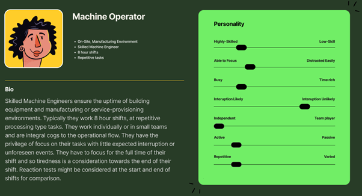
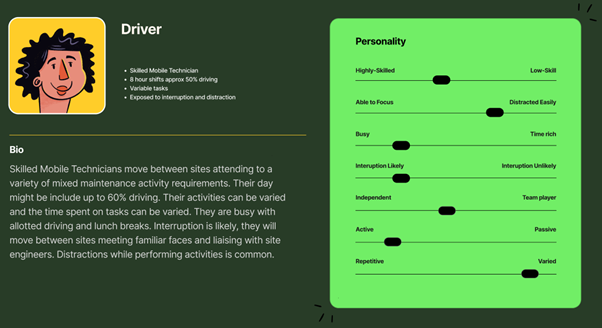

#### Design:
The specification is to build a reaction speed test. This will be based on the time between a stimulus (change of colour) and a reaction (click of the mouse). Other than these functional requirements we have some free reign. Using Design Thinking as a toolkit we don’t have too much to consider in terms of the empathy stage. We have a simple desktop application to build with limited functionality. The user experience does not need to accommodate a variety of different user needs. The interface should be simple and clear. The problem can be defined as a need to create a click-based reaction speed test. 

#### Ideate:
Using Figma I began prototyping framed around a ‘How might we?’ thought strategy. How might we be informed of the game intentions. How might we interact with the game. How might the results be presented. How might we relay the right information at the right time.

A very simple lo-fi wireframe model was created. Here we do not need to add anything other than the base containers of objects on the page. The basic requirements are for a ‘play area’ with boxes showing the scores. While creating the very first screen I decided to add 5 score boxes that will show the last 5 games on a rolling basis should the user play more than 5 times. Alongside this I added the play or click area. The page was given a title. With the first screen defined and incorporating the page objects required to fulfil the basic requirements. 

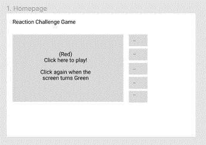

Following on from the first screen we can start to think about how we want the page to react after interaction. In this case starting the game. When the play area is clicked it will stay red for a certain amount of time and then turn green and await a click:

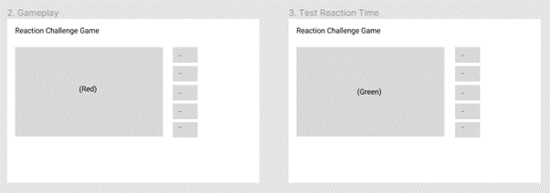

When the user clicks (submits their reaction time) the results will display.

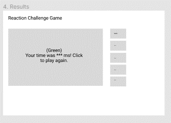

The full flow can be observed as:

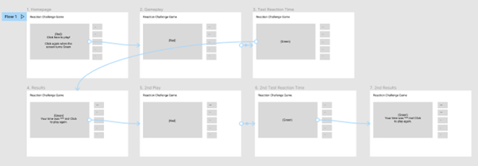
[Figma Lo-Fi](https://www.figma.com/file/JQZRIIBkOs0na5nVzV8jqd/Reaction-Game?node-id=719%3A2&t=J29nCaGuNWKQzdxK-1)

The connectors without a circle in the middle represent a click action and the connectors with circles in the middle represent a time-delay action (waiting for the colour to change).
Prototype:
Going through the click actions on the lo-fi version prompted some ideas for the first draft of a hi-fi version. Here I can start to think about the layout of the screen, the colours used and any additional information or interactivity that might be good for the first draft prototype. I added a clear title and an info graphic showing what is happening as a human user while conducting the reaction test.

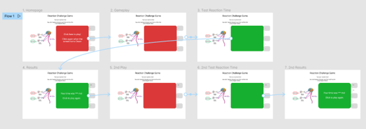
[Figma Hi-Fi](https://www.figma.com/file/JQZRIIBkOs0na5nVzV8jqd/Reaction-Game?node-id=713%3A40&t=J29nCaGuNWKQzdxK-1)

The prototype gives us a tangible product to help guide on additional requirements or enhancements through use of the product. New ideas will be logged as an issue/ticket. These will be evaluated for implementation and prioritisation. Ideas should be considered, in this case, for time to implement and benefit to the product.

Project Life-Cycle:
We will take an Agile approach to the project life-cycle. As defined by the SDLC we will be using an iterative project management approach. We don’t have lots of fixed requirements. A Test-Driven Development approach will be used to create the base code for the minimal viable product (working reaction test). Enhancements and priorities will be driven via an iterative approach with issue submissions and prioritisation after each deployment and push to the projects main branch (master code). The process here will be to develop code, test the code, and refactor the code. As well as being able to respond to changes in requirements, some flexibility is available to fix any unforeseen bugs and new development priorities. The project will be managed within GitHub projects. This provides a Kanban style board to identify tasks and the current task status. Kanban offers immediate insight into the status of work at any given time. We have a clear visual representation of the project tasks and status. The project has one developer and so Kanban is ideal as it focuses on achieving flow for the development team by limiting the work addressed at any one time.  The Kanban approach allows for re-prioritisation of a task. Iterations will not be of a fixed length. Some tasks will take longer than others to deliver, all tasks are expected to take hours and minutes rather than days.

This project allows us to take some level of risk. It is a small, simple requirement list that requires little code. 
•	All activity will be recorded as a GitHub issue
•	Solutions will be proposed via GitHub pull requests 
•	Updates will be made by merging the pull requests. 
•	All ideas and change proposals will be tracked by issue tickets as Kanban board items through the project stages of: To Do, In Progress, In Review and Done. 

We have a rough idea what the solution should look like but not what will really make the finished product stand out. Speed of delivery is very important with small iterative development items being delivered frequently. A key point here is that we have no time constraints on each iteration. For a larger project the issue tickets might be acknowledged in a scrum session where the project team meet on a regular basis, usually daily to prioritise the tickets to be addressed that day. Scrum allows us to focus on creating a working application as quickly as possible. Once the working application is deployed it will be continuously available until the next release which will be a fully working product. This means the planning, analysis, design, development, and testing into each iteration. In this very I will decide what requirements will be addressed, how they are implemented and test them before release.

##### Branch – index-html
At this stage we start to match the code with the design. Our clickable prototype provides a good basis for the containers and layout of the page and any initial styling of those pages
The first piece of coding is in HTML. This code defines the page content and what content goes where. The elements of the page are given a class that allows us to write CSS styling code for that element of the page. We are using CSS to size the elements on the page, add colour to the click area and add the welcome message text. At this stage the screen does nothing when clicked.

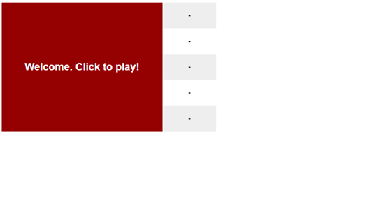

#### Branch – initial-interactivity

The next piece of code is the Javascript (JS) code which adds interactive functionality to the page elements. Here we are adding the click and response behaviour to the play area. For the HTML elements to pick up the JS instructions the HTML code has one small update to use the JS code.
The page elements are now interactive, the play area can be clicked, the writing disappears, and the screen turns green expecting a click. When clicked it presents the reaction speed time.

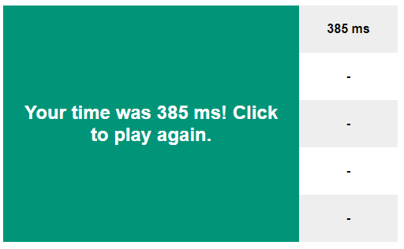

The gameplay area is now very close to the prototype version in terms of clicks but the time for the screen to change is now completely randomised (as opposed to the default delay time of the prototype)

#### Branch – headers

To align with the prototype, I added some headers with the next update. This was a simple update to the HTML code. No styling has been applied yet.

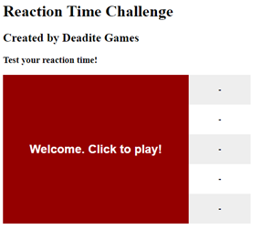

#### Branch – accessibility-colour - First unforseen requirement!

This was the first issue raised that deterred from the original prototype. Given the accessibility issues red/green presents I wanted to update the colours used from red/green to a more accessible blue/orange for colour deficient users. Here we updated the CSS file and the JS file because the JS file contains the colour the click area changes to, and the CSS has the starting colour.

#### Branch – format-headers
This step provides font and positioning of the header text

#### Branch – image-gameplay-sections
To align with the prototype, I needed to create a new section on the page to place the image object. I also decided to move the image associated text above the image itself. This required a change to the HTML code to create the sections and add the object elements. It gets us to here, some alignment is needed!

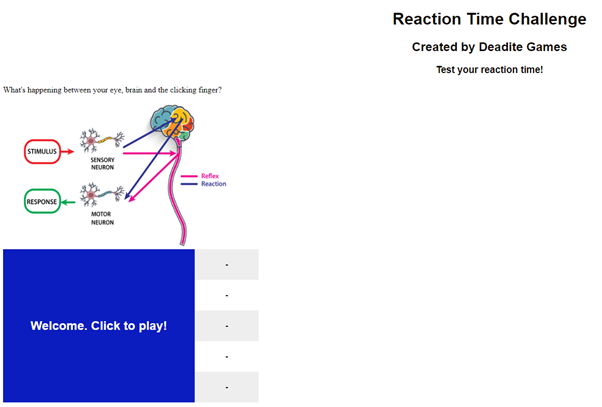

#### Branch – page-layout
Here we add some alignment instructions for the new sections and the body of the page which consists of the image and the play area with an update to the CSS file

#### Branch – image-text-bug, rounding-edges
A bug was created here for the display of the image text. It was fixed with additional CSS for paragraph text with some additional padding. The edges of the gameplay area and the score boxes were rounded for aesthetics.

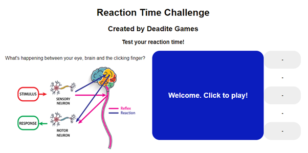

The flexible nature of the approach has enabled me to incorporate enhancements such as the accessibility changes and relevance of the presented information while creating the MVP. It differs very slightly from the original prototype with the incorporated improvements.

This takes us into the iterative development phase of the project. We have a working MVP. Users can now suggest enhancements and raise bugs through continued testing of the app. During the project we have linked the to do item tickets to code updates to create the MVP. We will use the same process for enhancement tickets, proposed code updates and other changes to improve the tool.

### Unit Testing:
During development of the MVP white box testing was conducted while building the whole app. Additional coding was executed and new project issues were created to address the test findings. The next step demonstrates the use of the JEST framework. With the addition of the enhancement detailed below (age-range feedback) I introduced new code that was not optimised. The need to test the code in smaller parts identified where refactoring of the code will improve maintenance and testability in the future. The code that delivers the age range recommendation for the user’s achieved score has a function that defines the age ranges returned. 

To demonstrate a test-driven development approach, I used Jest to unit test this piece of code. The unit testing led to code improvements and a better solution. There are several tickets raised that were necessary to align my remote data in GitHub with my local machine to avoid conflicts.

#### Branch – first-test-no-conflicts

This branch addresses those issues and delivers the updated DOM location.

An early enhancement identified while using the app is to get some meaningful feedback on how you performed. With the addition of some boundaries for expected performance by age ranges we can suggest what age range would be associated to the performance for play.
This was added initially by a large if/else statement within the existing EventListener function.

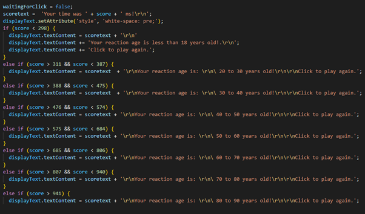

The update produced the following results, note the new message in the middle:

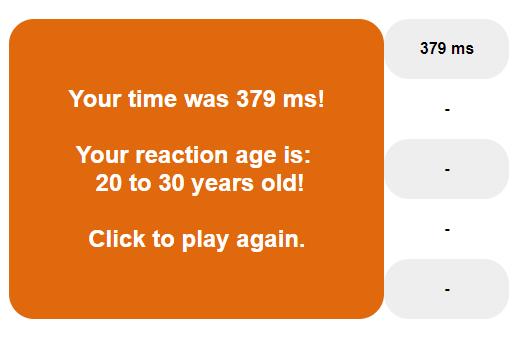

An output of a Test-Driven-Development approach is efficient code. The large if/else statement was refactored in two new pull requests for code refactoring. The first refactoring step moved the code to a new function’ scorefeedback’. This takes the score parameter produced by the eventlistener and identifies the age range it belongs to. Further refactoring improvements take the age range selection away from the constant message elements of the ‘scorefeedback’ function. These elements include the score and the surrounding text. The age group changes depending on the score achieved, therefore it is better to split this out to a separate function so if the ranges need to be made more granular or the messages differ per age range then it only needs to be changed within one function in the future
The neater code results in:

A function that delivers the consistent score message

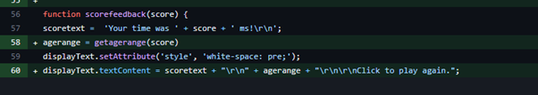

and a cleaner CASE statement replaces the large if/else in a new function called ‘getagerange’.

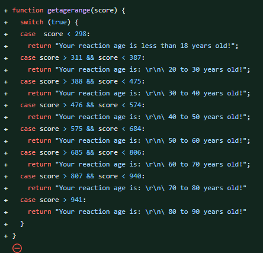

To start with I tested the break points of the age ranges. A smoketest was created to ensure Jest was working as expected

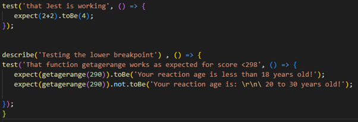

The first test passed:

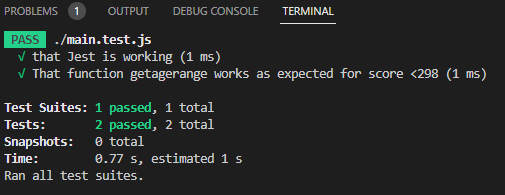

We expected specific test feedback and received the correct messages. Further testing of the breakpoint identified a problem with the code:

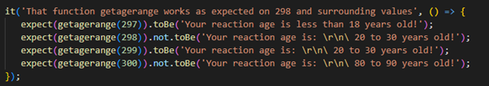

Here we find the code has a gap

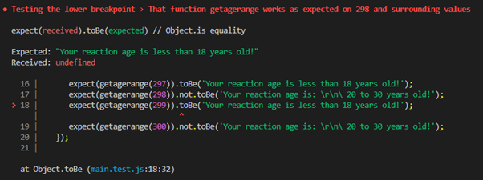

There is nothing being returned for value 299. We have a gap in the code!

Following the TDD approach, a ticket is raised acknowledging the error, a fix can be proposed and submitted as a pull request.

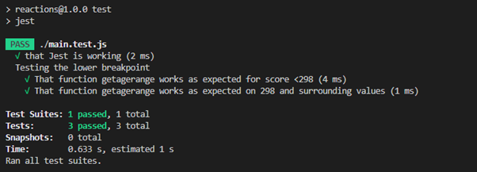

The code has been improved through test-driven development! Initially I had to refactor the code to be able to test the specific function, then testing uncovered a problem with the code that has been fixed. An issue was created, a solution proposed with improved code, the test was carried out again and test passes recorded. Additional testing was progressed using the same process in GitHub and the full test file can be viewed there. A new CI workflow was setup in GitHub to run the test with each new commit to the main branch. This ensures all tests can be recorded and checked while application dependant files are changing. Test coverage, that is what percentage of my code is being tested via unit tests.

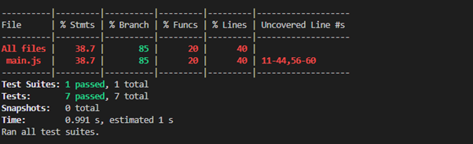
