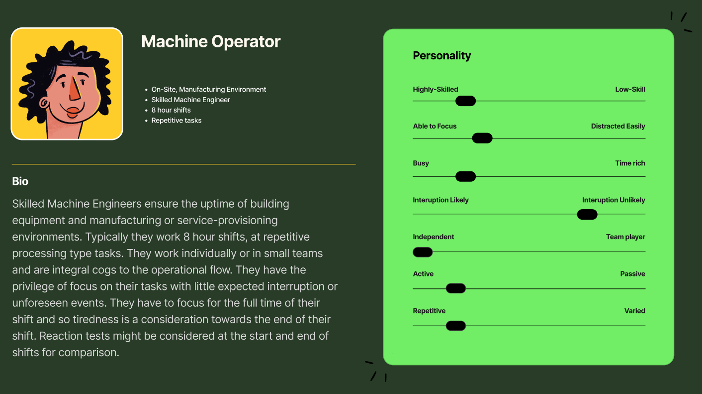
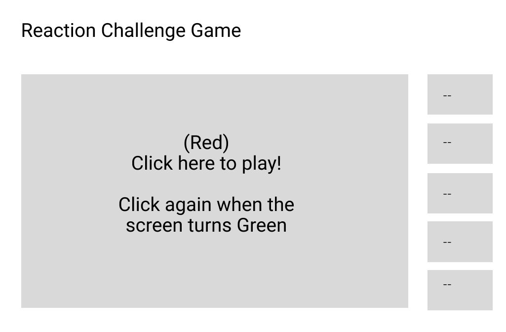
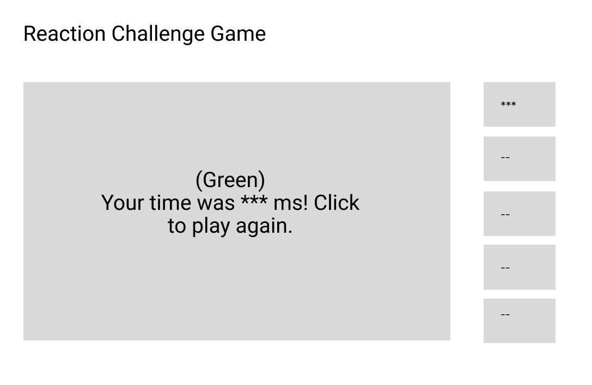
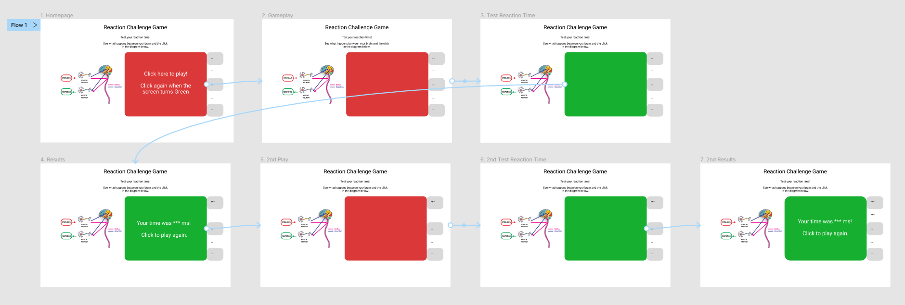

# reactions
## Reaction Speed Challenge

### Introduction

"Reaction time is very important for our everyday lives and needs intact sensory system, cognitive processing, and motor performance. Reaction time is a good indicator of sensorimotor coordination and performance of an individual." (Balakrishnan et al, 2014)

Reaction Times determines the alertness of a person and must be of an acceptable level for staff responsible for certain activities such as driving, machine operation etc. Prolonged reaction times suggest impaired performance. This presents an opportunity for gamification of a reaction test!

For this project I will use an iterative System Development Life-Cycle (SDLC) to create a reaction test desktop application that will test reaction speed for observing a change in colour of an area of the presented screen. It can be considered an evolutionary lifecycle approach. This system will evolve through early prototyping. We will have a functional product very early for hands-on trial and testing. Enhancements will be delivered through frequent releases. This makes prioritisation and acceptance of new ideas flexible to accommodate changing ideas and needs identified during the testing.

Two user personas have been associated to this idea:

### Design:
The specification is to build a reaction speed test. This will be based on the time between a stimulus (change of colour) and a reaction (click of the mouse). Other than these functional requirements we have some free reign. Using Design Thinking as a toolkit we don’t have too much to consider in terms of the empathy stage. We have a simple desktop application to build with limited functionality. The user experience does not need to accommodate a variety of different user needs, all users will use the app in the same way and it will be fun to play for any user. The interface should be simple and clear. The problem can be defined as a need to create a click-based reaction speed test. 

### Ideate:
Using Figma I began prototyping framed around a ‘How might we?’ thought strategy. How might we be informed of the game intentions. How might we interact with the game. How might the results be presented. How might we relay the right information at the right time.

A very simple lo-fi wireframe model was created. Here we do not need to add anything other than the base containers of objects on the page. The basic requirement is for a ‘play area’ with output boxes displaying the scores. Prototyping raised some new requirements. I decided to add 5 score boxes that will show the last 5 games (on a rolling basis should the user play more than 5 times). Aside this I added the play or click area. The page was given a title. The first screen is defined and incorporates the page objects required to fulfil the interactive and output requirements. 

Following on from the first screen we can start to think about how we want the page to react from interaction. When the play area is clicked it will stay red for a certain amount of time and then turn green and await a click:

When the user clicks (submits their reaction time) the results will display in milliseconds(ms).

The full click-delay-flow can be reviewed here:
[Open the Figma Lo-Fi prototype here](https://www.figma.com/file/JQZRIIBkOs0na5nVzV8jqd/Reaction-Game?node-id=719%3A2&t=J29nCaGuNWKQzdxK-1)

The connectors without a circle in the middle represent a click action and the connectors with circles in the middle represent a time-delay action (waiting for the colour to change).

### Prototype:
Going through the click actions on the lo-fi version prompted new ideas for the first draft of a hi-fi version. Here I can started to think about the layout of the screen, the colours used and any additional information or interactivity that might be good for the first draft prototype. I added a clear title and an info graphic showing what is happening as a human user while conducting the reaction test.

[Open the Figma Hi-Fi prototype here](https://www.figma.com/file/JQZRIIBkOs0na5nVzV8jqd/Reaction-Game?node-id=713%3A40&t=J29nCaGuNWKQzdxK-1)

The prototype gives us a tangible application that helps initiate new ideas that can become requirements and enhancements through use of the application. New ideas will be logged as an issue/ticket. These will be evaluated for implementation and prioritisation. Ideas should be considered, in this case, for time to implement and benefit to the product.

Project Life-Cycle:
We will take an Agile approach to the project life-cycle. As defined by the SDLC we will be using an iterative project management approach. We don’t have many fixed requirements. A Test-Driven Development approach will be used to create the code for a working reaction test. Enhancements and priorities will be driven via an iterative approach with issue submissions and review and prioritisation after each new branch deployment. The process here will be to develop code, test the code, and refactor the code. As well as being able to respond to changes in requirements, some flexibility is available to fix any unforeseen bugs and new development priorities. The project will be managed within GitHub projects. This provides a Kanban style board to identify tasks and the current task status. Kanban offers immediate insight into the status of work at any given time. We have a clear visual representation of the project tasks and status. The project has one developer so Kanban is a good tool to achieve flow within the development team by limiting the work addressed at any one time.  The Kanban approach allows for re-prioritisation of a task. Iterations will not be of a fixed length. Some tasks will take longer than others to deliver, all tasks are expected to take hours and minutes rather than days.

This project allows us to take some level of risk. It is a small, simple requirement list that requires little code.

*	All activity will be recorded as a GitHub issue
*	Issues will be addressed and solutions will be proposed via GitHub pull requests on a new code branch
*	Updates will be made by merging the pull request branch to main. 
*	All ideas and change proposals will be tracked by issue tickets as Kanban board items through the project stages of: To Do, In Progress, In Review and Done. 

At the MVP (Minimum Viable Product) stage We have a rough idea what the solution should look like but not what will really make the finished product stand out. Speed of delivery is very important with small iterative development items being delivered frequently. A key point here is that we have no time constraints on each iteration. For a larger project the issue tickets might be acknowledged in a scrum session where the project team meet on a regular basis, usually daily to prioritise the work addressed that day. Scrum allows us to focus on creating a working application as quickly as possible. Once the working application is deployed it will be continuously available until the next release which will be a fully working product. This requires planning, analysis, design, development, and testing in each iteration. In this small project I will decide what requirements will be fulfilled, how they are implemented and test them before release.

Enhancement tickets raised following the delivery of the MVP can be considered for approval and review during the daily scrum sessions. Typically, the scrums would be conducted early in the day to agree and align developers on the priorities for the day. The tickets are then tracked on the GitHub Project Kanban board through the stages to completion. The image below shows how the tickets are represented by the tiles and the tiles are moved through each stage of the deployment process from ‘To do’ to ‘done’. The view shows many completed tickets with one yet to be prioritised.

#### Branch – index-html
At this stage I started matching the code with the design. The clickable prototype provided a base understanding for the containers and layout required on the page and any initial styling of those objects. The first piece of coding is in HTML. This code defines the page content and where it goes. The elements of the page are given a class that allows us to write CSS styling code for that element of the page. We are using CSS to size the elements on the page, add colour to the click area and add the welcome message text. At this stage the screen does nothing when clicked.

#### Branch – initial-interactivity

The next piece of code is the Javascript (JS) code which adds interactive functionality to the page elements. Here we add the click and response behaviour to the play area. For the HTML elements to pick up the JS instructions the HTML code has one small update instructing to use the JS code.
The page elements are now interactive, the play area can be clicked, the writing disappears, and the screen turns green expecting a click. When clicked it presents the reaction speed time. See in-code notes for code descriptions (main.js)

The gameplay area is now very close to the prototype version in terms of clicks but the time for the screen to change is now completely randomised (as opposed to the default delay time of the prototype).

#### Branch – headers

To align with the prototype, I added headers in the index.html file. No styling has been applied yet.

#### Branch – accessibility-colour - First unforseen requirement!

This was the first issue raised that deterred from the original prototype. Given the accessibility issues red/green presents (Colour Blind Awareness, 2023) I wanted to update the colours from red/green to a more accessible blue/orange for colour deficient users. Here we updated the CSS file and the JS file because thethe CSS has the starting colour and the js file has the colour change awaiting a click.

#### Branch – format-headers
This step provides font and positioning of the header text

#### Branch – image-gameplay-sections
To align with the prototype, I needed to create a new section on the page to place the image object. I also decided to move the image associated text above the image itself. This required a change to the HTML code to create the sections and add the object elements. It gets us to here, some alignment is needed!

#### Branch – page-layout
Alignment CSS was added for the sections and the body of the page, which consists of the image and the play area.

#### Branch – image-text-bug, rounding-edges
A bug was created for the display of the image text. It was fixed with additional CSS for paragraph text with some additional padding. The edges of the gameplay area and the score boxes were rounded for aesthetics.

The flexible nature of the approach has enabled me to incorporate enhancements such as the accessibility changes and relevance of the presented information while creating the MVP. It differs slightly from the original prototype but already incorporates improvements.

From a project perspective we enter the iterative development phase of the project. We have a working MVP. Users can now suggest enhancements and raise bugs through trial and testing of the app. During the project we have linked the to do item tickets to code updates to create the MVP. We will use the same process for enhancement tickets, proposed code updates and other changes to improve the tool.

### Unit Testing:
During development of the MVP white box testing was conducted while building the whole app. Additional coding was executed and new project issues were created to address the test findings. The next step demonstrates the use of the JEST framework. With the addition of the enhancement detailed below (age-range feedback) I introduced new code that was not optimised. The need to test the code in smaller parts identified where refactoring of the code will improve maintenance and testability. 

To demonstrate a test-driven development approach, I used Jest to unit test the age-range feedback messages. The unit testing led to code improvements and a better solution. There are several tickets raised that were necessary to align my remote data in GitHub with my local machine to avoid conflicts.

#### Branch – first-test-no-conflicts

This branch addresses those issues and delivers the updated location of document elements of the Document Object Module (DOM) (in index.html). This was required to automate the jest functionality on remote.

An early enhancement identified was to get some meaningful feedback on how a user performed. With the addition of some age-range boundaries for expected performance the results can suggest what age range would be associated to the performance for that play. This was added initially by a large if/else statement within the existing EventListener function.

The update produced the following results, note the new message in the middle:

An output of a Test-Driven-Development approach is efficient code. The large if/else statement was refactored into two new functions. The first refactoring step moved the code to a new function’ scorefeedback’. This takes the score parameter produced by the eventlistener and identifies the age range it belongs to. Further refactoring improvements take the age range selection away from the consistent message elements of the ‘scorefeedback’ function. These elements include the score and the surrounding text and they don;t change based on the score achieved. The age group does change; therefore it is better to split this out to a separate function so if the ranges need to be made more granular or the messages changed then it only needs to be changed within one function in the future
The neater code results in:

A function that delivers the consistent score message

and a cleaner CASE statement replaces the large if/else in a new function called ‘getagerange’.

To start with I tested the break points of the age ranges. A smoketest was created to ensure Jest was working as expected

The first test passed:

A simple test. We expect specific age-range messages based on the score and received the correct messages. Further testing of the breakpoint identified a problem with the code:

Here we find the code has a gap

There is nothing being returned for value 299!

Following the TDD approach, tests are conducted, in the result of a failing test a ticket is raised, a fix can be proposed. The fix is approved and retested, then the fixed code can be merged with the master code. The code has been refactored.

The code has been improved through test-driven development! Initially I had to refactor the code to be able to test the specific function, then testing uncovered a problem with the code that has been fixed. An issue was created, a solution proposed with improved code, the test was carried out again and test passes recorded. Additional testing was progressed using the same process in GitHub and the full test file can be viewed there. These tests are recorded alongside any news ones. In GitHub a CI workflow was created to run all test with each new update to the main branch. This inherently delivers regression testing with all new deployments to main. It ensures all tests can be recorded and checked while application dependant files are changing. Test coverage was also introduced, that is what percentage of my code is being tested via unit tests.

The results show that I have covered nearly 40% of my code with unit tests. 85% branch coverage, 20% of my functions are tested and 40 lines. This is because DOM lines are not being tested.

### Evaluation

I thoroughly enjoyed this project! Despite some unforeseen issues with conflicts between remote and local that were time-consuming to resolve. That said, the iterative nature of the project allowed for these bugs to be addressed while not impacting the result significantly. The learnt methodologies such as design thinking and the toolkit specified brought huge benefits to speeding up the design and resulted in a working viable product very early on. With a tangible product, new ideas came quickly. The project development model worked very well here with ideas evaluated and acted on to quickly enhance the product from a functional and build-quality perspective. Unseen changes, such as code refactoring, might not be obvious by a front-end user but are just as important for maintainability and testing. The Kanban visual of the project activities is good to understand the status of the work. It does lack the expected delivery time of a task but for a small fast-paced development model, tasks were not expected to be longer than a few hours.

The application presents in line with the original prototype and fulfils the requirement. It has been tested extensively by my children (trying to outdo each other). The project characteristics allowed for significant enhancements to the first draft being more accessible and adding the fun factor of something to achieve (a younger age classification). The game interface is clear and easy to understand. The model is documented, efficiently maintainable and testable on future releases. Further improvements have already been identified including a possible on-screen distraction to simulate sensory distractions at a time of focus. I would also like to spend more time polishing the aesthetics of the interface screen

### References

Balakrishnan, G. et al (2014) *A Comparative Study on Visual Choice Reaction Time for Different Colors in Females.* Available at: https://www.ncbi.nlm.nih.gov/pmc/articles/PMC4280496/#:~:text=Reaction%20time%20is%20very%20important,and%20performance%20of%20an%20individual. (Accessed: 20 April 2023).

Colour Blind Awareness (2023) *Types of Colour Blindness.* Available at: https://www.colourblindawareness.org/colour-blindness/types-of-colour-blindness/ (Accessed: 17 Jan 2020).